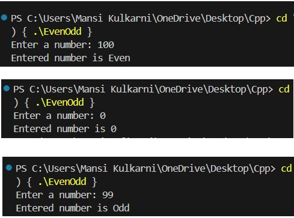
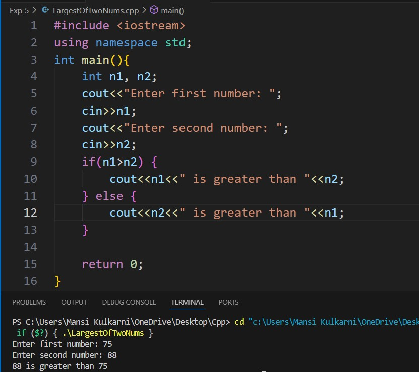
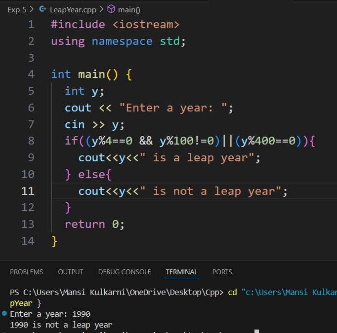
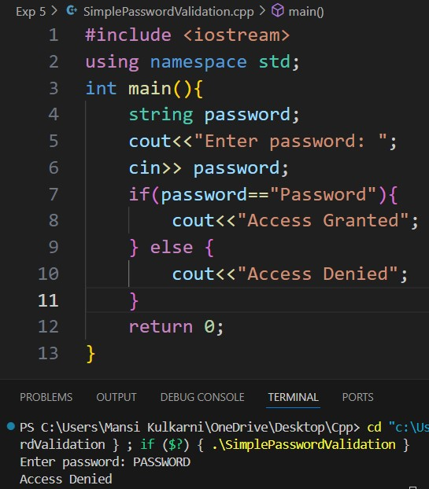
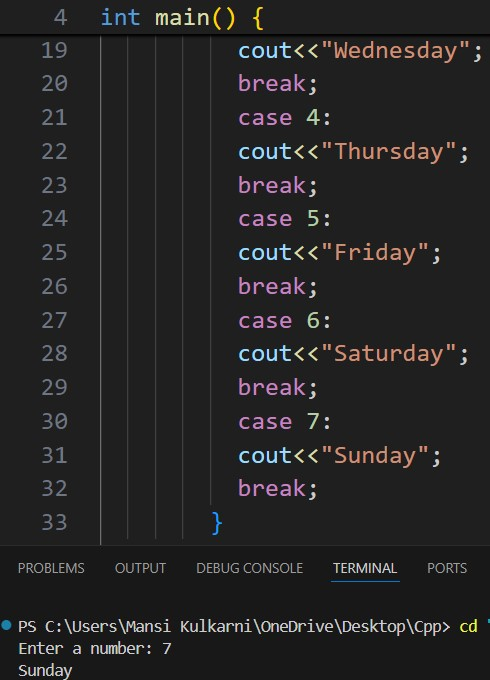
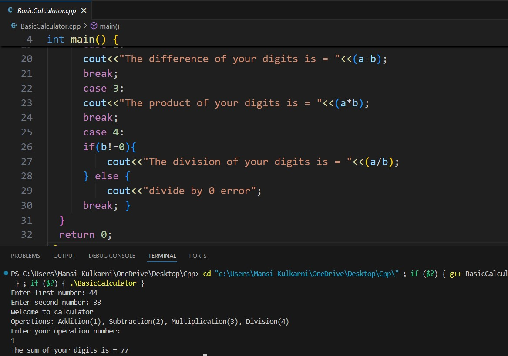
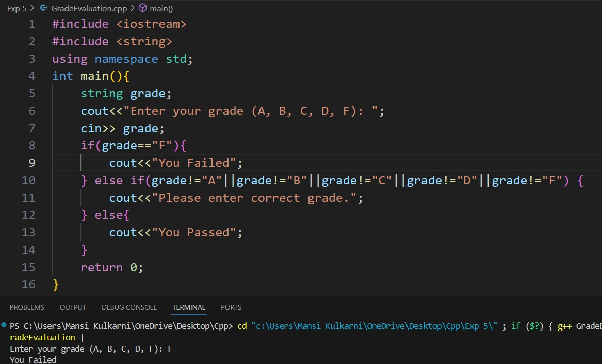

# Experiment 5
## Theory
Control structures in C++ allow for conditional execution of code blocks.
###
if: Executes a block of code if a specified condition is true.
###
else: Executes a block of code if the preceding if condition is false.
###
else if: Provides an additional condition to check if the preceding if condition is false. Multiple else if conditions can be used.
###
switch: Evaluates a variable against a list of possible values (cases) and executes the corresponding block of code. If none of the cases match, the default block (if provided) is executed.

## Program 1
### Aim: 
Checking if a Number is Even, Odd or zero.
### Software used: 
Visual Studio Code
### Output:

 
## Program 2
### Aim: 
Finding the Largest of Two Numbers
### Software used: 
Visual Studio Code
### Output:

## Program 3
### Aim: 
Checking if the user entered Leap Year. 
### Software used: 
Visual Studio Code
### Output:

## Program 4
### Aim: 
Simple Password Validation
### Software used: 
Visual Studio Code
### Output:

## Program 5
### Aim: 
Displaying Days of the Week
### Software used: 
Visual Studio Code
### Output:

## Program 6
### Aim: 
To make a simple calculator using switch case.
### Software used: 
Visual Studio Code
### Output:

## Program 7
### Aim: 
Grade Evaluation 
### Software used: 
Visual Studio Code
### Output:

## Conclusion
We learnt about decision making statements in C++ and saw their implementations. 
